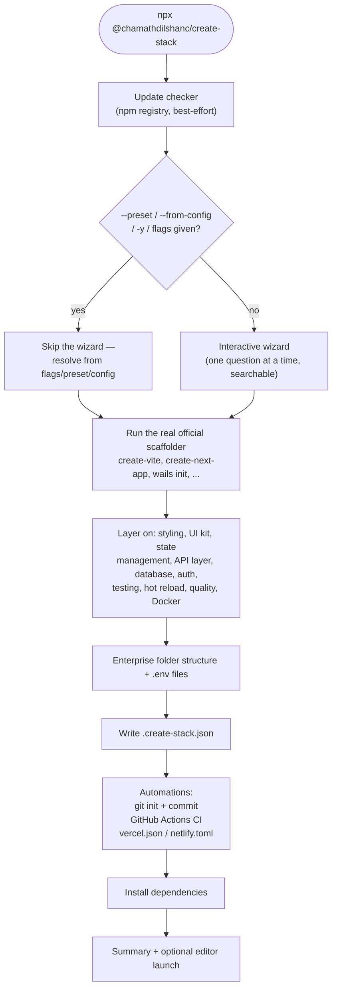
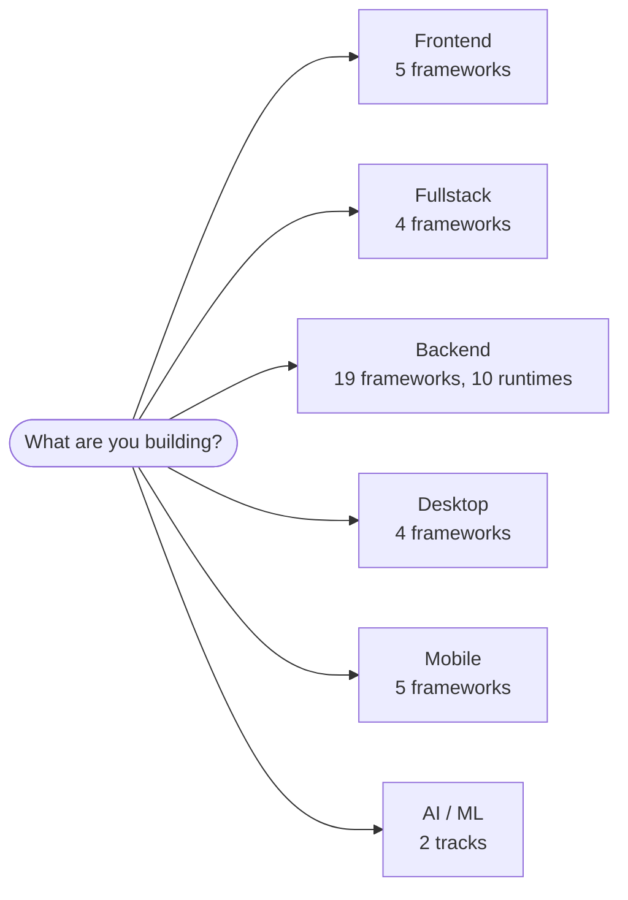

<p align="center">
  
</p>

# create-stack

[](https://www.npmjs.com/package/@chamathdilshanc/create-stack)
[](https://github.com/ChamathDilshanC/create-stack-cli/actions/workflows/ci.yml)
[](LICENSE)
[](https://nodejs.org)
[](#frameworks-by-project-type)
[](#frameworks-by-project-type)

**The Ultimate Multi-Tiered Project Orchestrator.** One interactive CLI, six project types, thirty-nine frameworks — every one of them scaffolded with its own real, official tooling. Not a static template you'll outgrow in a month; a live `create-vite`, `create-next-app`, `django-admin startproject`, `wails init`, or equivalent, run for you, then wired up with styling, a UI kit, state management, an API layer, a database, authentication, testing, hot-reloading, linting, Docker, CI, deployment config, and a git history that all actually match the stack you picked.

```bash
npx @chamathdilshanc/create-stack my-app
```

```
╭─ Create Stack CLI v3.8.5 ───────────────────────────────────────╮
│                              │ Tips for getting started         │
│  Welcome, you!               │ ❯ create-stack my-app            │
│         ◆                    │ ❯ --type backend -f nestjs       │
│  ████████████████            │ ❯ --preset saas                  │
│  ████████████████            │ ❯ --help                         │
│  ████████████████            │ ──────────────────────────────── │
│  ████████████████            │ Docs & support                   │
│                              │ ❯ github.com/.../create-stack-cli│
╰──────────────────────────────────────────────────────────────────╯
```

## Why this exists

Most scaffolders fall into one of two camps: a single-framework tool that does one thing well (`create-vite`, `django-admin`), or a "universal" generator that ships its own frozen copy of a template and slowly rots as the real ecosystem moves on. `create-stack` takes a third path — it never ships a template at all. Every scaffold is the *actual* official initializer, invoked live, so what you get is exactly what you'd get running that tool yourself — plus the tedious, error-prone wiring (styling configs, ORMs, auth, state management, an API layer, a UI kit, linting, Docker, CI, deployment config, environment files, a sane folder layout) done consistently across all of it, and a `git init` + first commit so you're never staring at an untracked pile of files.

## Table of contents

- [Features](#features)
- [Requirements](#requirements)
- [Installation](#installation)
- [Quick start](#quick-start)
- [How a run flows](#how-a-run-flows)
- [The decision tree](#the-decision-tree)
- [Frameworks by project type](#frameworks-by-project-type)
- [State management, API layer & UI kits](#state-management-api-layer--ui-kits)
- [Presets & config replay](#presets--config-replay)
- [Automations](#automations)
- [Hot reloading / auto-restart](#hot-reloading--auto-restart)
- [Update checker](#update-checker)
- [Non-interactive usage & CLI reference](#non-interactive-usage)
- [Recipes](#recipes)
- [What you get](#what-you-get)
- [How scaffolding works](#how-scaffolding-works)
- [Known limitations](#known-limitations)
- [Development](#development)
- [Deployment & releases](#deployment--releases)
- [License](#license)

## Features

- **Official scaffolders, not static templates** — every framework with one is scaffolded by running its own real initializer CLI: `create-vite`, the Angular CLI, `create-next-app`, `nuxi`, `sv create`, `create-astro`, the Nest CLI, `create-hono`, `create-tauri-app`, Electron Forge, `wails init`, `@neutralinojs/neu`, `create-expo-app`, the React Native Community CLI, `flutter create`, `ionic start`, `django-admin`, `composer create-project laravel/laravel`, `rails new`, `dotnet new webapi`, Fresh's own `deno run -r https://fresh.deno.dev`, and (for Spring Boot) start.spring.io itself. Express, Fastify, Flask, FastAPI, Axum, Actix-web, Gin/Fiber/Echo, Oak, and Ktor are the deliberate exceptions — none ships an official scaffolder, so those are generated by hand, cleanly, with a real working vertical slice (not a stub).
- **Six project types, one decision tree** — Frontend, Fullstack, Backend, Desktop, Mobile, AI/ML — each asking only the questions that make sense for it. No "styling" question for a backend API. No "state management" question for a Rust backend.
- **Thirteen backend runtimes** — Node, Python, Java, Rust, Go, PHP, Ruby, C#, Deno, and Kotlin all sit side by side, each with its own idiomatic package manager, quality tooling, and (where it makes sense) database story instead of Node's being force-fit everywhere.
- **Every menu is searchable** — type to filter project types, frameworks, styling, database, state management, API layer, UI kit, quality tooling, and package manager choices, instead of arrowing through a long list.
- **State management, an API layer, and a UI kit** — Zustand, Redux Toolkit, or Jotai for React/Next.js, Pinia for Vue/Nuxt; tRPC or GraphQL (Apollo/URQL) as an API layer; shadcn/ui, Material UI, Chakra UI, Ant Design, or DaisyUI as a UI kit — each wired with real, working code, not just an installed dependency. See [State management, API layer & UI kits](#state-management-api-layer--ui-kits).
- **Presets** — `--preset saas` (Next.js + Prisma + Auth.js + Vitest, Dockerized), `--preset blog` (Astro + Tailwind), `--preset api` (Express + Prisma), or `--preset mobile-app` (Expo + NativeWind) skip the wizard entirely with one flag; any individual flag on top of a preset still overrides it. See [Presets & config replay](#presets--config-replay).
- **Config replay** — every scaffold writes its own resolved decisions to `.create-stack.json`; point `--from-config` at that file (your own or a teammate's) to reproduce the exact same setup, non-interactively, under a new project name.
- **Automations** — a real `git init` + initial commit (skipped gracefully if Git isn't installed), a GitHub Actions workflow (`.github/workflows/ci.yml`, lint + test + build, shaped to whatever runtime/package manager you picked), and a starter `vercel.json` + `netlify.toml` for anything deployable — all generated automatically, no flag needed. See [Automations](#automations).
- **Hot reloading, wired for real** — a single yes/no question wires up `tsx --watch`/`node --watch` for hand-written Node backends, `air` (with a generated `.air.toml` + Makefile) for Go, and toggles `uvicorn --reload`/Django's autoreload/Flask's debug-mode reloader (plus `watchdog` for a faster file watcher) for Python — not just a flag left for you to wire up yourself. See [Hot reloading](#hot-reloading--auto-restart).
- **Update checker** — a fast, best-effort npm registry check at the very start of every run; if a newer version of `create-stack` exists, you'll see it before anything else prints.
- **Python backends, first-class** — Django, Flask, and FastAPI sit alongside the Node backends, each scaffolded into an isolated `.venv`, with their own quality tooling (Ruff, or Black + Flake8) and database options (Django's own ORM, or SQLAlchemy) instead of Node's.
- **Spring Boot, with a live dependency catalog** — the Java backend option talks straight to start.spring.io, the same API its own web UI uses. The dependency list is fetched fresh on every run and searched interactively (type to filter, space to toggle) instead of being bundled in this package, so it's never out of date with what Spring Initializr actually offers this week.
- **Six more backend runtimes, hand-wired the same careful way** — Rust (Axum or Actix-web), three Go frameworks (Gin, Fiber, Echo), Laravel (PHP), Ruby on Rails, ASP.NET Core (C#), two Deno frameworks (Fresh, Oak), and Ktor (Kotlin) — each with a real, working vertical slice (routes → handlers/services → an in-memory or ORM-backed repository), not a stub.
- **Four desktop frameworks** — Electron and Tauri (Chromium/Rust webviews), plus Wails (a Go backend + any web frontend) and Neutralino.js (a lightweight, dependency-light native wrapper) for when you don't want either.
- **Five mobile stacks** — bare React Native (the official Community CLI), Expo (React Native), Flutter (Dart), Ionic (React + Capacitor), and Kotlin Multiplatform — each with its own official scaffolder where one exists, own quality tooling where relevant, and (for React Native/Expo) NativeWind as a Tailwind-compatible styling option.
- **AI/ML, two ways** — a plain Python project (its own `.venv`) preloaded with curated library bundles (NumPy, Pandas, scikit-learn, TensorFlow, PyTorch, ...), or a JS/TS track: a real Next.js app pre-wired with the Vercel AI SDK (a working streaming chat UI) and a standalone LangChain.js example.
- **Styling** — Tailwind CSS v4 (the official Vite-plugin setup, or the framework's own `--tailwind`/`--add tailwind` flag when it has one), UnoCSS, or CSS Modules — wired into whichever config shape the framework actually uses.
- **Database / ORM** — Prisma (`prisma init`), Drizzle ORM, or Mongoose for Node; Django's own ORM or SQLAlchemy for Python — each installed with a real, working starter schema and client, not a bare dependency.
- **Authentication** — Auth.js (NextAuth), with real scaffolding for Next.js and Express (a Credentials provider, JWT sessions, a placeholder `authorize()` you replace with a real lookup); Clerk/Lucia/Passport are offered too, with an honest "not yet wired" note if picked.
- **Testing** — Vitest, with real scaffolding wherever Node testing applies; Jest/Playwright/Cypress are offered too, same "full menu, one real implementation" honesty.
- **Code quality** — ESLint + Prettier or Biome for Node; Ruff or Black + Flake8 for Python. A single choice, not two checkboxes you could contradict — and one that's skipped automatically when a framework (NestJS, Electron Forge, Ionic, `create-hono`) already ships its own working setup.
- **Docker** — an optional Dockerfile + `docker-compose.yml`, shaped to the project: multi-stage builds for every server runtime (Node, Python, Java, Rust, Go, PHP, Ruby, .NET, Deno, Kotlin), build-then-nginx for static frontends.
- **Enterprise folder structure** — a `.gitkeep`-tracked, feature-sliced layout, applied consistently across every project type (including Fullstack), placed in each framework's own real source directory — `src/`, Nuxt's `app/`, a Django project's settings package — never somewhere that fights the framework's own routing conventions.
- **`.env` / `.env.local` / `.env.production`** generated for every project, with each framework's own client-exposed variable prefix (`VITE_`, `NEXT_PUBLIC_`, `PUBLIC_`, `NUXT_PUBLIC_`, `EXPO_PUBLIC_`) applied automatically, and `.env.local` gitignored by default.
- **Auto-installs dependencies** with your package manager of choice — npm, yarn, pnpm, bun — or pip inside a fresh venv for Python.
- **Extra packages, searched live** — an optional step for every Node or Python project type: search the live npm registry (or check a name against PyPI) and add whatever you find, the same "search and add, never bundle a list" idea as Spring Boot's dependency picker, extended to every other ecosystem this CLI touches.
- **One connected terminal UI, start to finish** — built on [`@clack/prompts`](https://github.com/bombshell-dev/clack) (the same engine behind `create-astro`, `sv create`, and shadcn/ui's CLI), so every question, spinner, and the closing summary render as a single continuous thread instead of a patchwork of differently-styled prompts.
- **A dragon mascot, on any terminal** — a hand-placed Braille ASCII dragon (in the same spirit as neofetch's own distro art) renders right inside the startup banner box in every real terminal with 24-bit color support, Windows Terminal included — plain colored text, not a raster image, so there's no per-terminal graphics protocol to detect at all.
- **Open in a code editor when done** — VS Code, Cursor, Antigravity, or Claude Code, picked interactively after the summary (or preset via `--editor`) — see [Opening the project in a code editor](#opening-the-project-in-a-code-editor).
- **Non-interactive mode** via CLI flags, `--preset`, or `--from-config`, for scripting and CI.
- **Never leaves you stranded** — a failed network install, an existing non-empty directory, Ctrl+C mid-prompt, a missing toolchain (`air`, Gradle, the Wails CLI): every one of these ends in a clear message and a project you can still finish setting up by hand, not a stack trace.

## Requirements

| | |
| --- | --- |
| **Node.js** | `>=20.19.0` (needed to run the CLI itself, regardless of what you're scaffolding) |
| **Python 3** | only if you pick Django, Flask, FastAPI, or the Python AI/ML track — auto-detected as `python` on Windows or `python3` elsewhere |
| **Java 17+** | only if you pick Spring Boot, and only to actually build/run the generated project afterward — scaffolding itself just downloads a zip from start.spring.io, no local Java needed |
| **Rust toolchain (Cargo)** | only if you pick the Axum or Actix-web (Rust) backend, and only to actually build/run the generated project afterward — scaffolding itself just writes `Cargo.toml` + `src/main.rs` by hand, no local Rust needed |
| **Go toolchain** | only if you pick Gin/Fiber/Echo or Wails — Go's own module resolution handles the rest on first build; Wails additionally needs the [Wails CLI](https://wails.io/docs/gettingstarted/installation) itself (`go install github.com/wailsapp/wails/v2/cmd/wails@latest`) to actually scaffold |
| **PHP + Composer** | only if you pick Laravel — `composer create-project` is the actual scaffolder |
| **Ruby + Bundler** | only if you pick Ruby on Rails — `rails new` is the actual scaffolder |
| **.NET SDK** | only if you pick ASP.NET Core — `dotnet new webapi` is the actual scaffolder |
| **Deno** | only if you pick Fresh or Oak |
| **Gradle** (or IntelliJ/Android Studio) | only if you pick Ktor or Kotlin Multiplatform — used opportunistically to generate a `./gradlew` wrapper; the project still scaffolds without it, just without the wrapper |
| **Flutter SDK** | only if you pick Flutter — `flutter create` is the actual scaffolder for this one, so the SDK must be installed and on `PATH` *before* scaffolding |
| **Git** | recommended — a missing Git is handled gracefully (scaffolding still finishes, just without the automatic `git init` + commit) |
| **Docker** | only if you turn on the Docker option and actually want to build/run the generated container |

## Installation

You don't need to install anything up front — `npx` (or your package manager's equivalent) fetches and runs the latest version every time:

```bash
npx @chamathdilshanc/create-stack my-app
```

```bash
# Equivalent, if you prefer your own package manager's "create" convention
yarn create @chamathdilshanc/stack my-app
pnpm create @chamathdilshanc/stack my-app
bun create @chamathdilshanc/stack my-app
```

Prefer it always on hand? Install it globally instead:

```bash
npm install -g @chamathdilshanc/create-stack
create-stack my-app
```

## Quick start

Run it with no arguments and answer the prompts — each question only appears when it's relevant to what you picked before it:

```text
$ npx @chamathdilshanc/create-stack my-app

Project name: my-app
What are you building? Frontend
Select a framework: React
Language: TypeScript
Styling: Tailwind CSS (v4)
UI kit: shadcn/ui
State management: Zustand
API layer: GraphQL (Apollo Client)
Code quality tooling: ESLint + Prettier
Add Docker support? No
Install dependencies with: pnpm
Install dependencies now? Yes

✔ my-app is ready!
```

Prefer to skip straight to a known-good setup? `npx @chamathdilshanc/create-stack my-saas --preset saas` does the same thing in one line — see [Presets & config replay](#presets--config-replay).

## How a run flows





## The decision tree

Every question in the table below is searchable — type to filter, just like Spring Boot's dependency picker.

| Question | Shown for | Options |
| --- | --- | --- |
| Project type | always | Frontend, Fullstack, Backend, Desktop, Mobile, AI/ML |
| Framework | always | see [table below](#frameworks-by-project-type) |
| Language | unless the framework forces one | TypeScript (default), JavaScript — or nothing at all for Python/Java/Rust/Go/PHP/Ruby/C#/Deno/Kotlin/Dart frameworks |
| Styling | Frontend, Fullstack, Desktop, Mobile | **Web:** Tailwind CSS (v4), UnoCSS, CSS Modules, None · **Mobile:** NativeWind, None (not asked for Flutter/Ionic/KMP) |
| UI kit | Frontend/Fullstack, React family only | shadcn/ui, Material UI, Chakra UI, Ant Design, DaisyUI (shadcn/DaisyUI need Tailwind) · **every other framework:** DaisyUI only, and only with Tailwind on |
| State management | React/Next.js and Vue/Nuxt only | **React family:** Zustand, Redux Toolkit, Jotai, None · **Vue family:** Pinia, None |
| API layer | Frontend, Fullstack | tRPC, GraphQL (Apollo Client), GraphQL (URQL), None |
| Database / ORM | Backend, Fullstack (not Spring Boot, Rust, Go, Laravel, Rails, ASP.NET Core, Deno) | **Node:** Prisma, Drizzle ORM, Mongoose, None · **Python:** SQLAlchemy, None (Django always uses its own ORM; Laravel/Rails always use Eloquent/ActiveRecord) |
| Authentication | Backend, Fullstack | Auth.js (NextAuth), Clerk, Lucia, Passport, None |
| Testing | Frontend, Fullstack, Backend (Node only) | Vitest, Jest, Playwright, Cypress, None |
| Hot reload / auto-restart | Backend only | Yes (default) / No — see [Hot reloading](#hot-reloading--auto-restart) |
| Library bundles | AI/ML (Python track) only | grouped, curated PyPI catalog — Machine Learning, Web Scraping, Image Processing, Game Development, Automation Testing; see below |
| Build tool, packaging, Java version, dependencies | Spring Boot only | Maven/Gradle · Jar/War · whichever Java versions start.spring.io currently offers · its full dependency catalog, searched live (see below) |
| Spring hot reload | Spring Boot only | Yes (default) / No — wires in `spring-boot-devtools`; see below |
| Code quality | always | **Node:** ESLint + Prettier, Biome, None · **Python:** Ruff, Black + Flake8, None — not yet automated for Spring Boot, Rust, Go, PHP, Ruby, .NET, Deno, Kotlin (each already ships its own idiomatic tooling), or Flutter |
| Extra packages | Node and Python (not Spring Boot) | No (default) / Yes — search npm or check PyPI live and add whatever you find; see below |
| Docker | always | Yes / No |
| Package manager | Node frameworks only | npm, yarn, pnpm, bun (bare React Native: npm/yarn/bun only) — every other runtime uses its own idiomatic tool (pip, Maven/Gradle, Cargo, Go modules, Composer, Bundler, the .NET SDK, Deno, Gradle, `pub`) automatically |
| Install now | always | Yes / No — most non-Node runtimes skip this too, since their own tooling resolves dependencies on first build; Wails is the one Go-runtime exception (its frontend/ is a real npm project) |

Angular, NestJS, and bare React Native force TypeScript; Django, Flask, FastAPI, and the Python AI/ML track force Python; Spring Boot forces Java; Axum/Actix-web force Rust; Gin/Fiber/Echo and Wails force Go; Laravel forces PHP; Rails forces Ruby; ASP.NET Core forces C#; Fresh/Oak force TypeScript; Ktor/KMP force Kotlin; Flutter forces Dart; Ionic forces TypeScript — each also skips the package-manager question entirely. Trying to answer any of those with a flag just gets silently overridden to the correct value, the same way it would if you answered the prompt "wrong."

### Spring Boot's dependency picker

Unlike every other choice in the decision tree, Spring Boot's dependency list isn't defined anywhere in this repository — it's fetched from `start.spring.io/metadata/client` at the moment you answer the question, the same live catalog start.spring.io's own web UI reads from. Type to search across the whole thing (name or description), space to toggle a match, enter to confirm. If start.spring.io can't be reached, a short built-in fallback list (Web, Data JPA, H2, PostgreSQL/MySQL drivers, Validation, Lombok, DevTools, Security, Actuator) is used instead, with a warning in the final summary telling you to re-run once you're back online for the full catalog. The generated project itself — `pom.xml`/`build.gradle`, the Maven/Gradle wrapper, `src/main/java/...` — comes straight from start.spring.io's `starter.zip` endpoint, so it's exactly what start.spring.io would hand you directly.

On top of that bare project, `src/spring.js` lays down the same kind of layered package skeleton every other backend in this CLI gets, Java-shaped: `controller/`, `service/`, `dto/`, and `exception/` (seeded with a real, working `GET /api/hello` endpoint through all four layers — only when `web`/`webflux` is among your chosen dependencies), `model/` and `repository/` (seeded with a demo JPA `User` entity + `JpaRepository` — only when `data-jpa` is selected), and `config/` as an empty package ready for what you add next.

### Spring Boot's own hot reload

Answering "Yes" here (the default) adds `spring-boot-devtools` to the project, which restarts the app on its own the instant it sees recompiled classes. **Gradle** pairs it with `--continuous`, giving a genuine watch-and-reload loop with nothing extra to install (`./gradlew bootRun --continuous`); **Maven** has no built-in watch mode, so DevTools still restarts on a recompile, but you need your IDE's "build automatically" (or a manual `./mvnw compile`) to actually trigger one.

### AI/ML's library picker (Python track)

Unlike Spring Boot's dependency catalog (fetched live from start.spring.io) or the npm/PyPI search below, there's no live "top ML packages" API to query — so this ships a small curated, static catalog instead, grouped the same way Spring's own picker is: **Machine Learning** (NumPy, Pandas, SciPy, Matplotlib, Seaborn, Scikit-learn, TensorFlow, Keras, PyTorch), **Web Scraping** (Requests, Beautiful Soup, Scrapy, Selenium, lxml), **Image Processing** (OpenCV, scikit-image, Mahotas, SimpleITK, Pillow), **Game Development** (Pygame, Pyglet, PyOpenGL, Arcade, Panda3D), and **Automation Testing** (Pytest, Splinter, Robot Framework, Behave). Space toggles one entry or a whole group at once, enter confirms.

### NativeWind (React Native / Expo)

NativeWind brings Tailwind's utility-class `className` syntax to React Native, on both bare React Native and Expo. It's a different major line from the Tailwind v4 used everywhere else in this CLI — NativeWind v4 pins its own peer dependency on `tailwindcss@^3.4.17`, so mobile projects get `@tailwind base/components/utilities` (v3 syntax) instead of the `@import "tailwindcss"` (v4) used for web. Not offered for Flutter (its own widget-based styling system), Ionic (its own CSS-variable theming plus Shadow DOM components), or Kotlin Multiplatform (no styling layer to speak of yet).

### Extra packages, searched live (Node and Python)

Spring Boot's dependency picker works because Spring Initializr's whole catalog is small enough (~150 entries) to fetch once and filter client-side. npm has millions of packages — there's no equivalent single fetch — so this works as a loop instead: type a search term, pick zero or more of the (up to 15) results returned by npm's own public search API, and repeat with another term, or leave the search box blank to finish. PyPI is different again: its public search API was retired years ago, so this asks for exact package names one at a time and checks each one is real (`pypi.org/pypi/<name>/json`) before adding it — still live, just a verification rather than a search. Either way, nothing not found is added silently: a name that doesn't resolve shows up in the final summary's "Heads up" section instead.

## Frameworks by project type

| Type | Frameworks | Scaffolded with |
| --- | --- | --- |
| **Frontend** (5) | React, Vue, Angular, Svelte, SolidJS | `create-vite` (all but Angular) · the Angular CLI (`ng new`) |
| **Fullstack** (4) | Next.js, Nuxt.js, SvelteKit, Astro | `create-next-app` · `nuxi init` · `sv create` · `create-astro` |
| **Backend** (19) | Express.js, NestJS, Fastify, Hono, Django, Flask, FastAPI, Spring Boot, Axum (Rust), Actix-web (Rust), Gin (Go), Fiber (Go), Echo (Go), Laravel (PHP), Ruby on Rails, ASP.NET Core (C#), Fresh (Deno), Oak (Deno), Ktor (Kotlin) | the Nest CLI · `create-hono` · `django-admin startproject` · start.spring.io's `starter.zip` · `composer create-project laravel/laravel` · `rails new` · `dotnet new webapi` · Fresh's own `deno run -r https://fresh.deno.dev` · hand-written for Express/Fastify/Flask/FastAPI/Axum/Actix-web/Gin/Fiber/Echo/Oak/Ktor (none has an official scaffolder) |
| **Desktop** (4) | Electron, Tauri, Wails (Go + Web), Neutralino.js | Electron Forge (`create-electron-app`) · `create-tauri-app` · `wails init` · `@neutralinojs/neu create` |
| **Mobile** (5) | React Native, Expo (React Native), Flutter (Dart), Ionic (React), Kotlin Multiplatform | the React Native Community CLI · `create-expo-app` · `flutter create` · `ionic start` · hand-written (no scriptable public API for the JetBrains KMP wizard) |
| **AI/ML** (2) | Python (Data Science / ML), Next.js + Vercel AI SDK (JS/TS) | hand-written `main.py` + `.venv`, preloaded with your chosen library bundles · `create-next-app`, pre-wired with the Vercel AI SDK + LangChain.js |

## State management, API layer & UI kits

Three optional layers, asked only for Frontend/Fullstack projects and — for state management and UI kits specifically — only for the frameworks each one actually has real wiring for:

| Layer | Choices | Real wiring | Where it lands |
| --- | --- | --- | --- |
| **State management** | Zustand, Redux Toolkit, Jotai (React family) · Pinia (Vue family) | React (Vite) and Next.js for the first three; Vue (Vite) and Nuxt for Pinia | `src/store/` (Vite) or `store/` (Next.js — its App Router has no `src/` by default); Redux Toolkit's `<Provider>` wraps the app automatically |
| **API layer** | tRPC · GraphQL (Apollo Client) · GraphQL (URQL) | tRPC: Next.js only (it needs both a server and a client in one app). GraphQL clients: React and Next.js | tRPC: `server/`, `app/api/trpc/[trpc]/route.ts`, `trpc/client.ts`. GraphQL: `src/lib/apollo-client.ts` or `urql-client.ts`, pointed at a placeholder endpoint (`VITE_GRAPHQL_ENDPOINT`/`NEXT_PUBLIC_GRAPHQL_ENDPOINT` in `.env`) |
| **UI kit** | shadcn/ui · Material UI · Chakra UI · Ant Design · DaisyUI | shadcn/ui: a real `npx shadcn init` (React + Next.js, Tailwind required). MUI/Chakra/Ant Design: React + Next.js. DaisyUI: any framework, as long as Tailwind is on | shadcn/ui's own `components/ui/` (with a working demo Button); MUI/Chakra get a theme file + provider; DaisyUI just adds `@plugin "daisyui";` to your Tailwind stylesheet |

Every one of these is a real dependency install plus real generated code — a working counter store, a `hello` tRPC procedure you can call from a client component, a GraphQL client pointed at a placeholder you swap for your real API, a demo shadcn Button — never just a bare `npm install` with nothing to show for it.

**Composable, not exclusive.** Pick Redux Toolkit *and* tRPC *and* Material UI on the same Next.js project and all three wire in correctly — a shared `app/providers.tsx` composes each feature's client-side provider around your app (`<Provider store={store}><TrpcProvider><MuiProvider>{children}</MuiProvider></TrpcProvider></Provider>`), and the final summary tells you the one two-line edit needed to wrap `app/layout.tsx` in it.

Picking something without real wiring for your framework (tRPC on Astro, MUI on Vue) still works — the project scaffolds successfully, and the summary tells you plainly that it wasn't auto-wired, the same "full menu, one real implementation" honesty this CLI already uses for Auth.js/testing.

## Presets & config replay

**Presets** bundle a known-good combination of answers behind one flag, skipping the wizard entirely:

```bash
npx @chamathdilshanc/create-stack my-saas --preset saas    # Next.js, Tailwind, Prisma, Auth.js, Vitest, Docker
npx @chamathdilshanc/create-stack my-blog --preset blog    # Astro, Tailwind, Vitest
npx @chamathdilshanc/create-stack my-api  --preset api     # Express, Prisma, Vitest, Docker
npx @chamathdilshanc/create-stack my-app  --preset mobile-app  # Expo, NativeWind
```

Any flag alongside `--preset` still overrides it — `--preset saas -d drizzle` scaffolds the `saas` bundle with Drizzle instead of Prisma.

**Config replay** goes further: every successful scaffold writes its own fully-resolved decisions to `.create-stack.json` in the new project's root. Point `--from-config` at that file to reproduce the exact same setup somewhere else — your own past project, or one a teammate committed to their repo:

```bash
npx @chamathdilshanc/create-stack my-app-2 --from-config ./my-app/.create-stack.json
```

The positional project name always wins over whatever name is stored in the config, so replaying under a new name (or into a fresh directory) just works. Flags on top of `--from-config` override it the same way they override a preset — `--from-config ./old/.create-stack.json -d mongoose` swaps just the database. Both `--preset` and `--from-config` imply `--yes`: they exist specifically to skip the wizard, so there's no need to pass `-y` alongside either one.

## Automations

Three things happen automatically after every successful scaffold, right after `.create-stack.json` is written — no flag needed, and none of them can fail the scaffold itself (a missing tool just means a warning, not a crash):

1. **Git** — `git init` (skipped if the directory already has a `.git`, e.g. after `--overwrite`) and a real `git commit` of everything that was just generated, including the CI workflow and deployment config below. Silently skipped if Git isn't installed at all (see [Requirements](#requirements)).
2. **GitHub Actions CI** (`.github/workflows/ci.yml`) — a lint + test + build workflow shaped to your actual stack. Node projects get steps that only run when the corresponding `package.json` script actually exists (so the workflow stays green regardless of which quality/testing tool you picked, or none); every other runtime gets its own official setup action (`setup-python`, `setup-java`, `setup-go`, `dtolnay/rust-toolchain`, `setup-php`, `ruby/setup-ruby`, `setup-dotnet`, `setup-deno`) and native build command. Wails additionally builds its `frontend/` npm project first, since its Go binary embeds that build output.
3. **Deployment config** (`vercel.json` + `netlify.toml`) — for Frontend/Fullstack projects, plus the Next.js AI/ML track. Deliberately minimal: Vercel's own framework auto-detection already covers everything this CLI scaffolds, so `vercel.json` only pins `installCommand`/`buildCommand`; Netlify's Frameworks API auto-detects Next.js/Nuxt/SvelteKit/Astro the same way, so `netlify.toml` only adds an explicit `publish` directory for plain Vite SPAs, which it can't infer on its own.

## Hot reloading / auto-restart

One yes/no question for Backend projects (default: yes) — "Set up auto-restart / hot-reloading for development?" — wired to whatever your chosen runtime actually uses:

| Runtime | Tool | What changes |
| --- | --- | --- |
| Node (Express/Fastify, hand-written) | `tsx watch` (TypeScript) or `node --watch` (JavaScript) | The `dev` script in `package.json` — "No" drops the `watch` flag, giving a plain one-shot run instead |
| Go (Gin/Fiber/Echo) | [`air`](https://github.com/air-verse/air) | A generated `.air.toml` + `Makefile` (`make dev` runs `air`); if `air` isn't on `PATH`, a warning tells you how to install it, and `make dev` falls back to a plain `go run .` |
| FastAPI | `uvicorn --reload` | Already on by default in the dev command; "No" drops the flag |
| Django | `runserver`'s own autoreload | Already on by default; "No" appends `--noreload` |
| Flask | Werkzeug's debug-mode reloader | Baked into the generated `app.run(debug=...)` call at scaffold time; "Yes" also adds `watchdog` as a dependency, which Werkzeug auto-detects for faster, OS-native file-change events instead of slow stat-polling |

NestJS, Hono, and any other framework whose own official scaffolder already ships hot-reloading by default (`nest start --watch`, `tsx watch` from `create-hono`) get a plain, honest note in the summary instead of a broken attempt to turn it off — there's no CLI flag in either tool yet to disable it.

## Update checker

The very first thing this CLI does on every run, before the banner or any prompt: a bounded, best-effort check against the npm registry for the latest published version. If a newer one exists, you'll see it immediately:

```
! Update available: 3.8.5 → 3.9.0
Run npx @chamathdilshanc/create-stack@latest next time to get the newest version.
```

Offline, a slow network, or a registry hiccup never delays or breaks scaffolding — the check is capped at 1.5 seconds and fails silently.

## Non-interactive usage

Every prompt can be skipped by passing the equivalent flag, a `--preset`, or `--from-config`. Combine `--yes` with the required flags (`--type`, `--framework`, and a package manager for Node frameworks) to run fully non-interactively — this is exactly what this project's own CI does, across a representative combination per project type, on every push.

```bash
npx @chamathdilshanc/create-stack my-api \
  --type backend \
  --framework nestjs \
  --database prisma \
  --quality eslint-prettier \
  --docker \
  --pm pnpm \
  --yes
```

### CLI reference

| Flag | Description |
| --- | --- |
| `[project-directory]` | Directory to create the project in (positional argument) |
| `--type <type>` | Project type: `frontend`, `fullstack`, `backend`, `desktop`, `mobile`, `ai` |
| `-f, --framework <name>` | Framework within the chosen type (see the table above) |
| `-l, --language <lang>` | `ts` or `js` — ignored (and unnecessary) for every framework that forces its own language |
| `-s, --styling <name>` | `tailwind`, `unocss`, `css-modules`, `none` — Mobile: `nativewind`, `none` |
| `-d, --database <name>` | Node: `prisma`, `drizzle`, `mongoose`, `none` · Python: `sqlalchemy`, `none` — ignored for Spring Boot (use `--dependencies`), Rust/Go (always `none`), Laravel/Rails (always their own ORM) |
| `-a, --auth <name>` | `authjs`, `clerk`, `lucia`, `passport`, `none` — only Auth.js has real scaffolding so far, and only for Next.js/Express |
| `-t, --testing <name>` | `vitest`, `jest`, `playwright`, `cypress`, `none` — only Vitest has real scaffolding so far |
| `-q, --quality <name>` | Node: `eslint-prettier`, `biome`, `none` · Python: `ruff`, `black-flake8`, `none` — ignored for runtimes with their own built-in tooling |
| `--docker` | Add a Dockerfile + `docker-compose.yml` |
| `-p, --pm <manager>` | Package manager: `npm`, `yarn`, `pnpm`, `bun` (Node frameworks only) |
| `--build-tool <tool>` | Spring Boot only: `maven` (default) or `gradle` |
| `--packaging <type>` | Spring Boot only: `jar` (default) or `war` |
| `--java-version <version>` | Spring Boot only: e.g. `21` (default), `17` |
| `--dependencies <list>` | Spring Boot only: comma-separated dependency ids, searched live from start.spring.io (e.g. `web,data-jpa,postgresql`) — defaults to `web` |
| `--group-id <id>` | Spring Boot only: Java group ID (default: `com.example`) |
| `--no-hot-reload` | Spring Boot only: skip `spring-boot-devtools` / auto-restart wiring (on by default) — the *generic* hot-reload question (Node/Go/Python) has no dedicated flag yet; answer it interactively or set `hotReload` in a `--from-config` file |
| `--extra-packages <list>` | Comma-separated extra packages, verified live before adding — npm for Node projects, PyPI for Python (Spring Boot: use `--dependencies` instead) |
| `--ml-libraries <list>` | AI/ML (Python track) only: comma-separated PyPI library bundles (e.g. `numpy,pandas,scikit-learn`) — see [AI/ML's library picker](#aimls-library-picker-python-track) |
| `--no-install` | Skip automatic dependency installation |
| `--editor <name>` | Open the finished project in a code editor when done: `vscode`, `cursor`, `antigravity`, `claude`, `none` — asked interactively when omitted (unless `-y`/`--yes`, which skips it by default); see [Opening the project in a code editor](#opening-the-project-in-a-code-editor) below |
| `--preset <name>` | Scaffold a known-good bundle of options (`saas`, `blog`, `api`, `mobile-app`) non-interactively — individual flags above still override it; see [Presets & config replay](#presets--config-replay) |
| `--from-config <path>` | Replay a previously generated `.create-stack.json` non-interactively — individual flags above still override it; see [Presets & config replay](#presets--config-replay) |
| `-y, --yes` | Skip prompts; fails if a required option isn't supplied via flags (implied by `--preset`/`--from-config`) |
| `--overwrite` | Overwrite the target directory if it already exists, without prompting |
| `-V, --version` | Print the CLI version |
| `-h, --help` | Print usage |

> State management, the API layer, and the UI kit have no dedicated CLI flags yet — set them interactively, or via `stateManagement`/`apiLayer`/`uiKit` in a `--from-config` file (the same field names a scaffold's own `.create-stack.json` already uses).

### Opening the project in a code editor

The last question this CLI ever asks — after the project is already fully scaffolded, so a "No" (or a `Ctrl+C`) here never affects anything before it: VS Code, Cursor, Antigravity, Claude Code, or None. Picking one launches that editor's own CLI (`code`, `cursor`, `antigravity`, or `claude`) pointed at the new project directory. VS Code/Cursor/Antigravity are spawned as detached background processes, so this CLI exits right after asking it to open. Claude Code is different: it's a terminal program, not a GUI window, so the current terminal is handed over to it directly instead, and this CLI's own process waits until you exit that Claude Code session.

Skipped automatically under `-y`/`--yes` unless `--editor <name>` is passed explicitly. If the chosen editor isn't installed or isn't on `PATH`, this prints a warning and moves on — same "never leaves you stranded" rule as everything else in this CLI.

## Recipes

A few complete, copy-pasteable examples across the stack:

```bash
# A React + Tailwind SPA with shadcn/ui, Zustand, and GraphQL — containerized
npx @chamathdilshanc/create-stack my-app --type frontend -f react -l ts \
  -s tailwind -q biome --docker -p pnpm -y

# A full SaaS starter in one flag
npx @chamathdilshanc/create-stack my-saas --preset saas

# The same, but with Drizzle instead of Prisma — flags still override a preset
npx @chamathdilshanc/create-stack my-saas --preset saas -d drizzle

# Replay a previous scaffold's exact decisions under a new name
npx @chamathdilshanc/create-stack my-app-2 --from-config ./my-app/.create-stack.json

# A NestJS API with Drizzle and hot reload off
npx @chamathdilshanc/create-stack my-api --type backend -f nestjs \
  -d drizzle -q eslint-prettier -p npm -y

# A Django API — Python, its own venv, its own ORM
npx @chamathdilshanc/create-stack my-django-api --type backend -f django \
  -q ruff --docker -y

# A Spring Boot API — Maven, Java 21, Spring Web + Data JPA + PostgreSQL,
# dependencies searched live from start.spring.io
npx @chamathdilshanc/create-stack my-spring-api --type backend -f spring \
  --build-tool maven --java-version 21 --dependencies web,data-jpa,postgresql --docker -y

# A Go API (Gin) with hot reload via air
npx @chamathdilshanc/create-stack my-go-api --type backend -f go-gin -y

# A Laravel API
npx @chamathdilshanc/create-stack my-laravel-api --type backend -f laravel -y

# A cross-platform desktop app — Wails (Go + Web)
npx @chamathdilshanc/create-stack my-desktop-app --type desktop -f wails -p npm -y

# A lightweight native wrapper — Neutralino.js
npx @chamathdilshanc/create-stack my-native-app --type desktop -f neutralino -y

# An Expo (React Native) app with NativeWind
npx @chamathdilshanc/create-stack my-mobile-app --type mobile -f expo \
  -l ts -s nativewind -q eslint-prettier -p npm -y

# An Ionic (React) hybrid app
npx @chamathdilshanc/create-stack my-ionic-app --type mobile -f ionic -p npm -y

# A Kotlin Multiplatform project
npx @chamathdilshanc/create-stack my-kmp-app --type mobile -f kmp -y

# A Flutter app
npx @chamathdilshanc/create-stack my-flutter-app --type mobile -f flutter -y

# An AI/ML project with a curated set of PyPI libraries
npx @chamathdilshanc/create-stack my-ml-project --type ai -f python-ml \
  --ml-libraries numpy,pandas,scikit-learn,matplotlib -y

# A Next.js AI chat app — Vercel AI SDK + LangChain.js
npx @chamathdilshanc/create-stack my-ai-app --type ai -f ai-nextjs -p npm -y
```

## What you get

Every scaffold, regardless of type, ends up with:

- **A working project** — buildable and runnable the moment dependencies are installed, using the framework's own real starter (not a placeholder "Hello World" with nothing wired up).
- **A `.create-stack.json`** in the project root recording every decision that produced it — reusable later via `--from-config`.
- **A real Git history** — `git init` + an initial commit of everything above, so `git log`/`git diff` work from the first moment you open the project (see [Automations](#automations)).
- **A GitHub Actions workflow** (`.github/workflows/ci.yml`) ready to push, shaped to your actual stack.
- **A starter `vercel.json` + `netlify.toml`**, for anything deployable.
- **A feature-sliced folder structure**, `.gitkeep`-tracked so empty directories survive being cloned:

  ```text
  # Frontend / Fullstack / Desktop / React Native / Expo / Ionic
  src/
  ├── assets/       ├── hooks/      ├── services/
  ├── components/   ├── layouts/    ├── store/
  ├── config/       ├── pages/*     └── utils/
  └── features/

  # Backend (Node or Python)
  src/  (or app/, or a Django project's own settings package)
  ├── config/       ├── models/**   └── utils/
  ├── controllers/  ├── routes/
  └── middlewares/  └── services/
  ```

  \* omitted for Next.js specifically — its App Router owns that name at the project root already.
  \*\* becomes `schema/` automatically when Drizzle is the chosen ORM.

  A few frameworks get their own idiomatic equivalent instead of this exact layout, rather than skipping structure entirely:

  - **Spring Boot**: `controller/`, `service/`, `dto/`, `repository/`, `model/`, `config/`, `exception/` as real packages under `src/main/java/...` — see [Spring Boot's dependency picker](#spring-boots-dependency-picker) above for what gets seeded with working code versus left as an empty package.
  - **Rust (Axum/Actix-web)** and **Go (Gin/Fiber/Echo)**: a real, working, modular split (`routes`/`handlers`/`services`/`repository`/`models`/`config`) — not one big file.
  - **Ktor (Kotlin)**: the same layered split, Gradle Kotlin DSL-shaped, with a `./gradlew` wrapper generated opportunistically when a system Gradle is available.
  - **Flutter**: `lib/config/`, `lib/models/`, `lib/screens/`, `lib/services/`, `lib/utils/`, `lib/widgets/` — Dart-flavored naming, since `flutter create` on its own only ever produces a bare `lib/main.dart`.
  - **Kotlin Multiplatform**: a `shared/` module (`commonMain`/`jvmMain`/`commonTest`, `expect`/`actual`) plus a separate `app/` module owning the `application` plugin — Gradle's own KMP plugin rejects `application` applied directly to a multiplatform module, so the runnable entry point lives one module over.
  - **Wails**: a Go module at the root (`main.go`, `app.go`) plus a nested `frontend/` Vite project — its own real, separate npm-installable half.

- **Three environment files** — `.env` (safe defaults, meant to be committed), `.env.local` (empty, always gitignored, yours to fill in with real secrets), and `.env.production` (production-shaped placeholders) — each with the right variables for what you picked, including a placeholder `OPENAI_API_KEY` for the AI/ML JS/TS track and a placeholder GraphQL endpoint for Apollo/URQL.
- **A "Next steps" summary** tailored to what you built — the right install command if you skipped it, the right dev command (`npm run dev`, `wails dev`, `make dev`, `python manage.py runserver`, `uvicorn app.main:app --reload`, `./mvnw spring-boot:run`, `cargo run`, `go run .`, `flutter run`, `gradle :app:run`, `npx @neutralinojs/neu run`...), and a plain-English explanation of anything that couldn't be fully automated.

## How scaffolding works

There are no template folders in this repository. `src/scaffold.js` dispatches to one handler per project type, and each handler runs the official initializer for the chosen framework where one exists — see the [table above](#frameworks-by-project-type) for exactly which command. Python backends additionally get a fresh `.venv` created first, with every dependency step installing straight into it via that venv's own `pip`. Spring Boot (`src/spring.js`) fetches the current dependency catalog from start.spring.io, then downloads and extracts the actual generated project from the same service's `starter.zip` endpoint.

On top of whichever project that produces, the CLI layers, roughly in order:

1. **Styling** (`src/styling.js`) — installs the right packages and wires the plugin into the framework's actual config shape.
2. **UI kit** (`src/ui-kits.js`) — a real `shadcn init`, or a theme + provider for MUI/Chakra, or a `daisyui` Tailwind plugin registration.
3. **State management** (`src/state-management.js`) — a real store (Zustand/Jotai/Pinia) or a `<Provider>`-wrapped Redux Toolkit setup.
4. **API layer** (`src/api-layer.js`) — a real tRPC server+client, or a GraphQL client pointed at a placeholder endpoint.
5. **Database** (`src/database.js`) — `npx prisma init` for Prisma; a hand-written `drizzle.config.ts` + schema + client for Drizzle; a connection module + example model for Mongoose.
6. **Authentication** (`src/auth.js`) — Auth.js wired with a Credentials provider + JWT sessions, for Next.js/Express.
7. **Code quality** (`src/quality.js`) — ESLint+Prettier or Biome (Node), Ruff or Black+Flake8 (Python) — skipped for frameworks/runtimes with their own built-in tooling.
8. **Testing** (`src/testing.js`) — Vitest, wired with a real config and an example test.
9. **Hot reload** (`src/hot-reload.js`, plus inline wiring in `scaffold.js`/`backend-go.js`) — `tsx watch`/`node --watch`/`air`/`uvicorn --reload`, per runtime; see [Hot reloading](#hot-reloading--auto-restart).
10. **Docker** (`src/docker.js`) — a multi-stage Dockerfile shaped to the runtime, plus a matching `docker-compose.yml`.
11. **Enterprise structure** (`src/structure.js`) — the folder layout described above, placed in each framework's own real source directory.
12. **Environment files** (`src/env.js`) — always near the end, so it can see (and safely merge into, rather than duplicate) whatever `.env` entries earlier steps already wrote.
13. **`.create-stack.json`** — every resolved decision, written to the project root for later `--from-config` replay.
14. **Automations** (`src/automations.js`) — the GitHub Actions workflow and deployment config are written first (so they end up captured in the commit), then `git init` + the initial commit runs last, since it's the step that actually snapshots everything else on disk.

If a network step fails — installing Tailwind offline, a registry hiccup mid-scaffold — the CLI records the dependency in `package.json` (or `requirements.txt`) instead of crashing, finishes every remaining filesystem step, and tells you exactly which command to run once you're back online. A few official tools (`create-tauri-app`, Electron Forge, `create-hono`, `ionic start`'s Capacitor integration) always make some network call of their own regardless of `--no-install`; the CLI warns about that rather than pretending it didn't happen.

### This repository's own layout

```text
create-stack-cli/
├── bin/
│   └── cli.js                  # Shebang entry point
├── src/
│   ├── index.js                 # CLI parsing + main flow + summary + update checker call
│   ├── update-checker.js        # npm registry version check, run at the very start
│   ├── presets.js                # Named --preset bundles (saas, blog, api, mobile-app)
│   ├── banner.js                 # Startup banner (boxen + picocolors)
│   ├── prompts.js                # The decision tree
│   ├── scaffold.js               # Orchestrator: one handler per project type
│   ├── scaffold-utils.js         # Shared execa/spinner/package.json/Next.js-provider plumbing (Node)
│   ├── python-utils.js           # Shared venv/pip plumbing (Python)
│   ├── runtime-check.js          # Toolchain presence checks (Go, Gradle, air, Wails CLI, ...)
│   ├── spring.js                 # Live start.spring.io metadata + project generation (Java)
│   ├── backend-go.js             # Gin/Fiber/Echo — hand-written, layered Go backend
│   ├── backend-php.js            # Laravel (composer create-project)
│   ├── backend-ruby.js           # Ruby on Rails (rails new)
│   ├── backend-dotnet.js         # ASP.NET Core (dotnet new webapi)
│   ├── backend-deno.js           # Fresh + Oak (Deno)
│   ├── backend-kotlin.js         # Ktor — hand-written Gradle Kotlin DSL backend
│   ├── desktop-wails.js          # Wails (Go + Web) — wails init
│   ├── desktop-neutralino.js     # Neutralino.js — @neutralinojs/neu create
│   ├── mobile-ionic.js           # Ionic (React) — ionic start
│   ├── mobile-kmp.js             # Kotlin Multiplatform — hand-written shared/+app/ Gradle project
│   ├── ai-nextjs.js              # AI/ML JS/TS track — Next.js + Vercel AI SDK + LangChain.js
│   ├── state-management.js       # Zustand / Redux Toolkit / Jotai / Pinia wiring
│   ├── api-layer.js              # tRPC / GraphQL (Apollo/URQL) wiring
│   ├── ui-kits.js                # shadcn/ui / Material UI / Chakra UI / Ant Design / DaisyUI wiring
│   ├── hot-reload.js             # air + .air.toml/Makefile generation for Go
│   ├── automations.js            # git init + commit, GitHub Actions CI, deployment config
│   ├── packages.js               # Live npm search / PyPI existence checks for extra packages
│   ├── styling.js                # Tailwind v4 / UnoCSS / NativeWind wiring
│   ├── database.js               # Prisma / Drizzle / Mongoose setup
│   ├── auth.js                   # Auth.js (NextAuth) setup
│   ├── quality.js                # ESLint+Prettier / Biome setup
│   ├── testing.js                # Vitest setup
│   ├── docker.js                 # Dockerfile + docker-compose.yml generation
│   ├── structure.js              # Enterprise folder generation
│   ├── env.js                    # .env / .env.local / .env.production generation
│   ├── starters.js               # Styled starter components written during styling setup
│   ├── install.js                # Node dependency installation (execa + clack spinner)
│   └── utils.js                  # Logger, validators, package-manager detection, clack spinner/cancel helpers
├── .github/workflows/ci.yml     # Matrix-tested scaffold + build + lint, then semantic-release
├── package.json
└── README.md
```

## Known limitations

- **Tailwind/UnoCSS on Electron** isn't auto-wired — Forge's template config layout varies too much to safely automate. A warning points you to the manual setup docs instead of risking a wrong guess.
- **UnoCSS on Angular/Electron** and **Tailwind's `content` detection on Astro/Nuxt** follow the same "warn, don't guess" rule when a config shape can't be confidently matched.
- **Ionic's styling** isn't auto-wired either — its own CSS-variable theming system, plus Shadow DOM in some components, makes a safe Tailwind integration a real project of its own rather than something to guess at.
- **`create-hono`'s `nodejs` template** currently pins a very new TypeScript version that `typescript-eslint` doesn't fully support yet — an upstream compatibility issue in `create-hono` itself, not something this CLI causes.
- **Desktop scaffolds (Tauri/Electron/Wails/Neutralino.js)** aren't build-tested in CI — they need a Rust/Go toolchain and native GUI libraries CI runners don't ship. CI verifies the scaffold lands correctly; the native build itself is on you to verify locally (Wails and Neutralino.js were both verified manually — a real `wails build` produced a working `.exe`, a real `neu run` launched the app — before release).
- **Rust, Go, PHP, Ruby, .NET, Deno, Kotlin/Ktor, React Native, Flutter, Ionic, and Kotlin Multiplatform aren't yet in the CI test matrix** — each needs its own toolchain/SDK a CI runner doesn't ship by default. All were verified manually against their real official tools before release (including a real `gradle :app:run`/`gradle :shared:jvmTest` for Kotlin Multiplatform, and a real `wails build` for Wails), but — unlike everything already in the matrix — they aren't re-verified on every push yet.
- **Kotlin Multiplatform only scaffolds a `jvm()` target** — `androidTarget()`/`iosX64()`/etc. each need their own SDK (Android Studio, Xcode) this CLI can't assume is installed; adding them is a couple of lines once you have the toolchain.
- **State management, API layer, and UI kit** have real wiring only for the React and Vue families (see [the table above](#state-management-api-layer--ui-kits)) — every other frontend/fullstack framework gets an honest "not yet wired" note instead of a guess.
- **FastAPI's dev command uses plain `uvicorn`**, not `fastapi dev` — the latter's `rich`-based emoji output can crash outright on a legacy (non-UTF-8) Windows console. `uvicorn` ships with `fastapi[standard]` either way and works everywhere.
- **Python requires Python 3 on PATH** (`python` on Windows, `python3` elsewhere — auto-detected). If it's missing, the CLI says so instead of failing with an opaque spawn error.
- **Spring Boot is Java-only for now** — Spring Initializr also supports Kotlin and Groovy, but this CLI forces `language: java`, and code-quality tooling isn't wired up for it yet.
- **The update checker and `--preset`/`--from-config` have no interaction with each other beyond the normal flag-override rules** — a preset or config doesn't currently pin a specific CLI version, so replaying an old config with a newer CLI version uses whatever that newer version's current defaults are for anything the config doesn't specify.

## Development

```bash
git clone https://github.com/ChamathDilshanC/create-stack-cli.git
cd create-stack-cli
npm install
npm start -- my-test-app   # runs bin/cli.js locally
```

Try it as if it were installed globally:

```bash
npm link
create-stack my-test-app
```

There's no build step and no test framework beyond `npm run test:smoke` (`bin/cli.js --help`) — the real verification is scaffolding a project and actually running it, which is exactly what CI does across the full matrix on every push.

## Deployment & releases

"Deploying" this project means publishing a new version of the CLI itself — releases are fully automated with [semantic-release](https://semantic-release.gitbook.io/) via `.github/workflows/ci.yml`. On every push to `main`:

1. **Test matrix** — a representative combination for every project type (Frontend, Fullstack, Backend including Python, Mobile) is scaffolded non-interactively, installed, linted, and built; Desktop scaffolds are verified to land correctly without a full native build (see [Known limitations](#known-limitations)).
2. **Commit analysis** — `semantic-release` reads every commit message since the last release using [Conventional Commits](https://www.conventionalcommits.org/):
   - `fix:` → patch release
   - `feat:` → minor release
   - `BREAKING CHANGE:` (in the commit body/footer) → major release
   - `docs:`, `chore:`, `ci:`, etc. → no release
3. **If a release is warranted**, it bumps `package.json`, updates `CHANGELOG.md`, publishes to **npm** and **GitHub Packages**, creates a Git tag + GitHub Release, and commits the version bump back to `main` (with `[skip ci]`, so it doesn't trigger itself again).

This requires an `NPM_TOKEN` repository secret (Settings → Secrets and variables → Actions) — an npm granular access token with **read/write** access to this package and **bypass 2FA** enabled — plus a `GH_PACKAGES_TOKEN` for the GitHub Packages publish step.

### Manual publish (fallback)

If the automated pipeline is ever unavailable:

```bash
npm login --registry=https://npm.pkg.github.com
npm publish --registry=https://npm.pkg.github.com   # GitHub Packages (publishConfig default)

npm login
npm publish --access public --registry=https://registry.npmjs.org   # public npm
```

### Deploying what you scaffold

This CLI's own Docker option (`--docker`) generates a Dockerfile and `docker-compose.yml` shaped for the project you picked. That's already enough to `docker build` and ship to any container host (Fly.io, Railway, a VPS, ECS/Cloud Run, ...). Framework-specific platforms work exactly as they would for a project you scaffolded yourself: Next.js/Nuxt/SvelteKit/Astro (and the AI/ML JS/TS track) all deploy cleanly to Vercel/Netlify/Cloudflare Pages using the `vercel.json`/`netlify.toml` this CLI already generated for you (see [Automations](#automations)), Expo apps ship via EAS Build, Ionic apps package via Capacitor, and Tauri/Electron/Wails apps package for their target OS via their own bundler (`tauri build`, `electron-forge make`, `wails build`).

## License

MIT — see [LICENSE](LICENSE).
